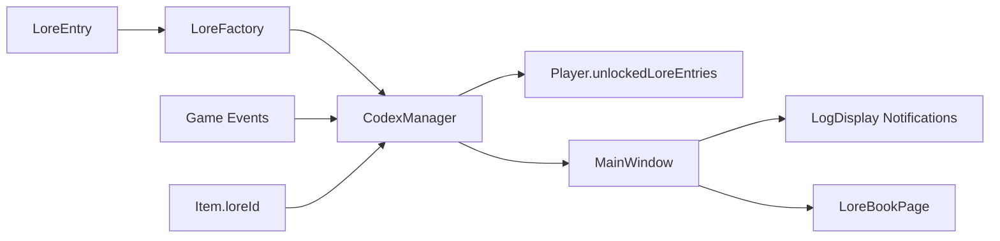

# CLAUDE.md

**Note**: This project uses [bd (beads)](https://github.com/steveyegge/beads)
for issue tracking. Use `bd` commands instead of markdown TODOs.
See AGENTS.md for workflow details.

This file provides guidance to Claude Code (claude.ai/code) when working with code in this repository.

## Project Overview

PyrpgQt is a turn-based RPG game built with Qt6 (C++17) featuring character creation, combat, inventory management, and save/load functionality. The application uses a QStackedWidget-based architecture for view navigation and implements the Qt Widgets framework with custom styling via QSS.

## Build System

This project uses CMake with Qt6 automation features:
- **CMAKE_AUTOMOC**: Automatically runs Qt's Meta-Object Compiler
- **CMAKE_AUTOUIC**: Automatically processes Qt UI files
- **CMAKE_AUTORCC**: Automatically compiles Qt Resource files

### Common Commands

```bash
# Configure and build
mkdir -p build && cd build
cmake ..
make

# Run the application
./pyrpg-qt

# Run all tests
ctest

# Run specific test
./test_models
./test_mainwindow
./test_persistence

# Build from root directory
cmake --build build

# Clean build
rm -rf build && mkdir build && cd build && cmake .. && make
```

## Architecture

### Core Components

**MainWindow** (`src/MainWindow.h/cpp`)
- Central controller managing all game views via QStackedWidget
- Handles navigation between different game screens
- Owns the Game instance and coordinates game state with UI updates
- Connects view signals to game logic handlers

**Game** (`src/game/Game.h/cpp`)
- Core game logic controller (QObject-based)
- Manages Player, Monster instances, and combat state
- Interfaces with SaveManager for persistence
- Provides combat flow: startCombat(), playerAttack(), monsterAttack(), isCombatOver()

**SaveManager** (`src/persistence/SaveManager.h/cpp`)
- Handles game serialization/deserialization using QDataStream
- Save/load operations for Player state including inventory, equipment, stats
- All model classes (Character, Player, Monster, Item, Skill) implement QDataStream operators

### Data Model Hierarchy

```
Character (base class)
├── Player (adds mana, stats, inventory, equipment, experience)
└── Monster (enemy entities)

Item (equipment, consumables, with QDataStream support)
Skill (player abilities)
```

**Player** inherits from **Character** and adds:
- Stats: strength, dexterity, intelligence, vitality, mana
- Inventory system: QList<Item*> inventory, QMap<QString, Item*> equipment
- Progression: experience, skillPoints, statPoints, gold

### View Layer

All views inherit from QWidget and are managed by MainWindow's QStackedWidget:

- **MainMenu**: Entry point (New Game, Load Game, Exit)
- **NewGameView**: Character name input and class selection
- **CharacterCustomizationPage**: Character creation UI
- **AdventurePage**: Main exploration hub (Explore, Rest, Save/Load, Shop, Stats)
- **CombatPage**: Turn-based combat interface
- **InventoryPage**: Player inventory management
- **StatsPage**: Character statistics display
- **MonsterStatsPage**: Enemy information display
- **SaveLoadPage**: Save/load game UI
- **ShopPage**: Item purchasing interface

### Custom Components

Located in `src/components/`:
- **AnimatedProgressBar**: Animated health/mana bars
- **ShadowedProgressBar**: Progress bars with shadow effects
- **ItemCard**: Visual item representation
- **ItemSelectionOverlay**: Item interaction overlay
- **LogDisplay**: Combat/event log display
- **ParticleSystem**: Visual effects system
- **StatusIndicator**: Character status display
- **ValidationLabel**: Input validation feedback
- **CharacterPreviewWidget**: Character appearance preview
- **CustomizationSection**: Character customization controls
- **ScalablePixmapLabel**: Image scaling widget

### Asset Management

**Qt Resource System** (`assets.qrc`):
- All assets embedded in the executable via Qt's resource system
- Access pattern: `":/assets/filename.ext"`
- Includes: images (character sprites, items, backgrounds), styles.qss
- Resources are compiled into the binary via CMAKE_AUTORCC

**Styling**: Global QSS stylesheet at `assets/styles.qss` loaded in main.cpp
- Theme constants defined in `src/theme/Theme.h` (colors, spacing, fonts)
- Dark theme with crimson accent color (#dc3545)

### Factory Pattern

**ItemFactory** (`src/game/factories/ItemFactory.h/cpp`):
- Static methods for item creation
- `generateRandomItem(int enemyLevel)`: Procedural loot generation
- `getShopItems()`: Returns predefined shop inventory
- `createItem(const QString &name)`: Named item instantiation

## Testing

Uses Qt Test framework (Qt6::Test). Three test suites:

1. **test_models**: Tests Player, Monster, ItemFactory
2. **test_mainwindow**: Integration tests for UI and game flow
3. **test_persistence**: SaveManager serialization tests

Test files must include the moc file: `#include "test_filename.moc"` and use `QTEST_MAIN(TestClassName)` macro.

## Important Implementation Details

### Adding New Source Files

When adding .cpp files, update **CMakeLists.txt** in relevant sections:
- Main executable: `add_executable(pyrpg-qt ...)`
- Test executables: Each test target needs dependencies
- All tests must link against `Qt6::Widgets Qt6::Test`
- Include directories: `target_include_directories(... PRIVATE src)`

### Resource File Updates

When adding assets:
1. Place file in `assets/` directory
2. Add entry to `assets.qrc` within `<qresource prefix="/">` tags
3. Access in code via `":/assets/filename"`
4. Rebuild (CMAKE_AUTORCC will recompile resources)

### Serialization

Models requiring persistence must implement:
```cpp
friend QDataStream &operator<<(QDataStream &out, const ClassName &obj);
friend QDataStream &operator>>(QDataStream &in, ClassName &obj);
```

### Signal/Slot Connections

Views emit signals that MainWindow connects to handler methods:
- Pattern: `void handleActionClicked()` slot methods in MainWindow
- Navigation: Switch stackedWidget page in handler
- State updates: Call Game methods and refresh UI accordingly

## Lore System Architecture (Phase 5)

The lore/codex system provides world-building through collectible narrative entries unlocked via gameplay.

### Core Components



**LoreEntry** (`src/models/LoreEntry.h`)
- Plain struct with 7 fields: entryId, category, title, shortDescription, fullText, imagePath, discoveryTrigger
- Categories: Bestiary, Items, World, Characters, Locations
- Discovery triggers format: `kill_EnemyName_Count`, `quest_complete_QuestId`, `item_get_ItemName`

**LoreFactory** (`src/game/factories/LoreFactory.cpp`)
- Static factory creating all lore entries (30 total: 8 Bestiary, 6 Items, 6 World, 5 Characters, 5 Locations)
- Entries cached in static map to prevent re-allocation
- Methods: createLoreEntry(entryId), getAllLoreEntries(), getLoreByCategory(category)
- Dark fantasy voice/tone across all entries with interconnected narrative

**CodexManager** (`src/game/CodexManager.h/cpp`)
- QObject managing lore discovery and persistence
- Event handlers: onEnemyKilled(), onQuestCompleted(), onItemCollected()
- Unlocking: unlockEntry(entryId) checks Player's unlockedLoreEntries, emits loreUnlocked signal
- Duplicate prevention: Entries can only unlock once per Player
- Connected to QuestManager signals for automatic quest-based unlocks

**Player.unlockedLoreEntries** (`src/models/Player.h`)
- QList<QString> storing IDs of unlocked lore entries
- Persisted through save/load via QDataStream operators
- Methods: hasUnlockedLore(entryId), unlockLore(entryId), getUnlockedLoreEntries()

**Item.loreId** (`src/models/Item.h/cpp`)
- QString field linking items to lore entries (empty if no associated lore)
- Added in serialization version 2 with backward compatibility
- Assigned in ItemFactory for legendary/rare items (15-20 items total)

### Data Flow

**Discovery Flow**:
1. Game event occurs (enemy killed, quest completed, item acquired)
2. CodexManager event handler triggered (onEnemyKilled, onQuestCompleted, onItemCollected)
3. Handler checks discovery trigger against lore entries
4. If match found and not already unlocked, calls unlockEntry(entryId)
5. CodexManager emits loreUnlocked(entryId, title) signal
6. MainWindow.handleLoreUnlocked() displays notification in LogDisplay with Theme::PRIMARY color
7. Player.unlockedLoreEntries updated for persistence

**Item-Lore Flow**:
1. Player acquires item (combat loot, shop purchase, quest reward)
2. Item added to Player.inventory
3. If item.loreId not empty, CodexManager.unlockEntry(loreId) called
4. Notification displayed, lore unlocked

### Unlock Hooks

**Game.cpp** (combat loot drops)
- Line 477-479: Random loot lore unlock
- Line 491-493: Final boss legendary lore unlock

**ShopPage.cpp** (shop purchases)
- After inventory.append(): Check item.loreId, call Player.unlockLore()

**DialogueManager.cpp / QuestManager.cpp** (quest rewards)
- After item rewards: Check item.loreId, call Player.unlockLore()

### UI Integration

**LoreBookPage** (`src/views/LoreBookPage.h/cpp`)
- QTabWidget with 5 tabs (one per category)
- Entry list (QListWidget) shows unlocked entries
- Detail panel (QTextEdit) displays full lore text
- Keyboard shortcut: 'L' key opens lore book
- Future enhancements: Search bar, progress indicators, sorting, locked entry previews

**LogDisplay Notifications** (`src/MainWindow.cpp:753-760`)
- Format: `<span style='color:PRIMARY'>New Codex Entry:</span> {title}`
- Non-intrusive combat log messages
- Multiple unlocks queue sequentially

### Serialization Version 2 (Phase 5)

**Item.cpp operator<<**:
```cpp
out << quint32(2);  // Version 2: Added loreId field
out << i.name << ... << i.loreId;
```

**Item.cpp operator>>**:
```cpp
quint32 version;
in >> version;
in >> i.name >> ... >> i.description;
if (version >= 2) {
    in >> i.loreId;
} else {
    i.loreId = "";  // Backward compatibility
}
```

**Backward Compatibility**: Version 1 saves (pre-Phase 5) load without crashes. Items default to empty loreId.

### Discovery Trigger Patterns

Format specifications for discoveryTrigger field:
- **Kill count**: `kill_EnemyName_Count` (e.g., "kill_Goblin_5" unlocks on 5th goblin kill)
- **Quest completion**: `quest_complete_QuestId` (e.g., "quest_complete_main_quest_01")
- **Item acquisition**: `item_get_ItemName` (e.g., "item_get_Healing Potion")
- **Manual unlock**: `manual` (unlocked via code or at game start)

**CodexManager.cpp event handlers**:
- onEnemyKilled: Increments kill count, checks `kill_X_Count` triggers
- onQuestCompleted: Checks `quest_complete_X` triggers
- onItemCollected: Checks `item_get_X` triggers

### Content Guidelines

**Voice/Tone**:
- Dark fantasy atmosphere consistent across all 30 entries
- Active voice ("wolves emerged") not passive
- Brief shortDescription (1-2 sentences), detailed fullText (100-300 words)
- Interconnected references create cohesive world narrative
- Leave mystery - questions drive player curiosity

**Naming Convention**:
- Entry IDs: `category_name` format (e.g., "bestiary_goblin", "item_ancient_blade")
- Consistent namespacing enables searching and categorization

## Dependencies

- **Qt6**: Widgets (GUI), Test (unit testing)
- **C++17**: Standard library features
- **CMake 3.16+**: Build system
