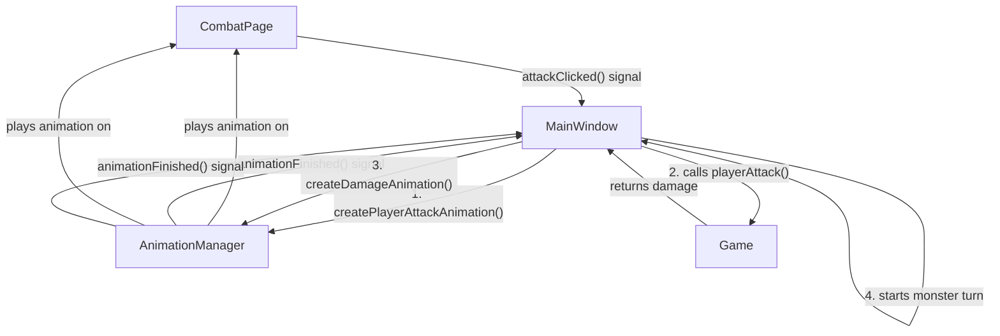

# PRD: Battle Arena Animations and Effects

## 1. Executive Summary

This document outlines the requirements for adding simple animations and visual effects to the battle arena in Pyrpg-Qt. The goal is to enhance the player experience by making combat more dynamic, engaging, and informative. This will be achieved by adding animations for attacks, skills, damage, and status effects.

## 2. Problem & Solution

### Problem

The current combat system is static. Actions and their outcomes are only communicated through text in the battle log. This lack of visual feedback makes combat feel lackluster and less immersive than it could be.

### Solution

We will introduce a system for playing animations and effects during combat. This system will provide visual feedback for player and monster actions, making the combat experience more exciting and easier to understand.

## 3. User Stories

### Epic: Enhanced Combat Visuals

#### Story 1: Player Attack Animation

**As a** player,
**I want** to see my character perform an attack animation,
**So that** I can feel more connected to the action and see a direct visual representation of my command.

**Acceptance Criteria:**
- When the player selects the "Attack" command, their character's sprite moves towards the enemy sprite.
- After a short delay, the sprite returns to its original position.
- The game waits for the animation to complete before processing the monster's turn.

#### Story 2: Damage Indication Effect

**As a** player,
**I want** to see a visual effect on a character when they take damage,
**So that** I can immediately understand who was hit and how effective the attack was.

**Acceptance Criteria:**
- When a character's health is reduced, their sprite flashes red briefly.
- A number indicating the amount of damage pops up near the character and fades out.
- Health bars animate down to the new value instead of updating instantly.

#### Story 3: Basic Skill/Magic Animation

**As a** player,
**I want** to see a simple visual effect when I use a skill or magic spell,
**So that** these actions feel more powerful and distinct from a standard attack.

**Acceptance Criteria:**
- When a skill is used, a particle effect (e.g., sparks, swirls) appears on or near the target.
- The effect should be customizable based on the skill type (e.g., fire, ice, healing).
- The game waits for the effect to finish before proceeding.

## 4. Technical Architecture

The proposed solution involves creating a dedicated `AnimationManager` class and refactoring the combat sequence in `MainWindow` to be asynchronous.

### System Components



1.  **`AnimationManager`**: A new class that will be responsible for creating and managing all combat animations. It will hold a reference to the `CombatPage` to manipulate its widgets. It will use `QPropertyAnimation` for movement and effects and `QSequentialAnimationGroup` / `QParallelAnimationGroup` to coordinate complex sequences. It will emit signals when animations are complete.
2.  **`CombatPage`**: Will be modified to provide public accessors to its UI elements (e.g., `getHeroSprite()`, `getEnemySprite()`) so the `AnimationManager` can animate them.
3.  **`MainWindow`**: The combat logic in `handleAttackClicked` and other action handlers will be refactored. Instead of a single synchronous function call, it will become a state-driven sequence that triggers animations and waits for their completion before processing game logic and the next turn.
4.  **`Game`**: No significant changes are required for the `Game` model, as it will remain the source of truth for game state.

### Data Flow

1.  Player initiates an action in `CombatPage`.
2.  `MainWindow` receives the signal and asks `AnimationManager` to play the corresponding action animation.
3.  `AnimationManager` plays the animation on the `CombatPage` widgets.
4.  Upon animation completion, `AnimationManager` emits a signal.
5.  `MainWindow` receives the signal, calls the `Game` object to calculate the outcome of the action.
6.  `MainWindow` updates the UI state via `updateCombatState`.
7.  `MainWindow` asks `AnimationManager` to play the result animation (e.g., damage effect).
8.  This sequence repeats for the monster's turn.

## 5. API Specifications

No new external APIs will be created. Internal APIs will be added to `CombatPage` and the new `AnimationManager`.

### `CombatPage` additions:

```cpp
// In CombatPage.h
public:
    QLabel* getHeroSpriteLabel();
    QLabel* getEnemySpriteLabel();
    QProgressBar* getHeroHealthBar();
    QProgressBar* getEnemyHealthBar();
```

### `AnimationManager` (new class):

```cpp
// In a new AnimationManager.h
class AnimationManager : public QObject {
    Q_OBJECT
public:
    AnimationManager(CombatPage* combatPage, QObject* parent = nullptr);
    void playPlayerAttackAnimation();
    void playMonsterAttackAnimation();
    void playDamageAnimation(QLabel* target, int damage);
    // ... other animations
signals:
    void animationFinished();
};
```

## 6. Implementation Phases

### Phase 1: Core Animation System

-   Create the `AnimationManager` class.
-   Refactor `MainWindow` to handle the asynchronous combat flow for a basic player attack.
-   Implement the player attack animation (sprite movement).
-   Implement the damage animation (sprite flash and damage number).

### Phase 2: Health Bar and Skill Effects

-   Implement animated health bar updates using `QPropertyAnimation`.
-   Add a basic particle effect system for skills (using `QGraphicsView` and `QGraphicsScene` or a simplified custom implementation if Qt Quick is not desired).
-   Integrate skill animations into the combat flow.

### Phase 3: Polish and Expansion

-   Add animations for monster attacks.
-   Create a larger variety of skill effects.
-   Add sound effects to accompany animations (out of scope for this PRD, but a natural next step).

## 7. Risks & Mitigations

-   **Risk**: Animations cause performance issues.
    -   **Mitigation**: Keep animations simple. Use efficient Qt classes like `QPropertyAnimation`. Profile performance on target hardware.
-   **Risk**: The asynchronous combat flow becomes complex and hard to manage.
    -   **Mitigation**: Use a simple state machine in `MainWindow` to manage the combat sequence. Keep the `AnimationManager` focused solely on visual effects.
-   **Risk**: Integrating particle effects is too complex.
    -   **Mitigation**: Start with very simple "particle" effects using `QLabel`s or custom-painted widgets. Evaluate the need for a full particle system in Phase 2.

## 8. Success Metrics

-   **Performance**: The game maintains a smooth frame rate during combat with animations enabled.
-   **User Feedback**: (If available) Users report that combat feels more engaging and fun.
-   **Clarity**: The animations and effects make it easier to understand what is happening during combat without relying solely on the text log.
