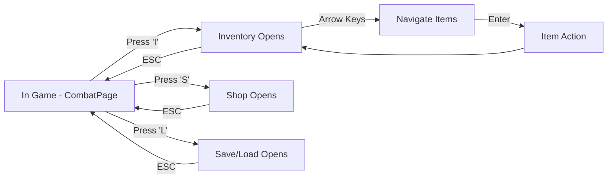
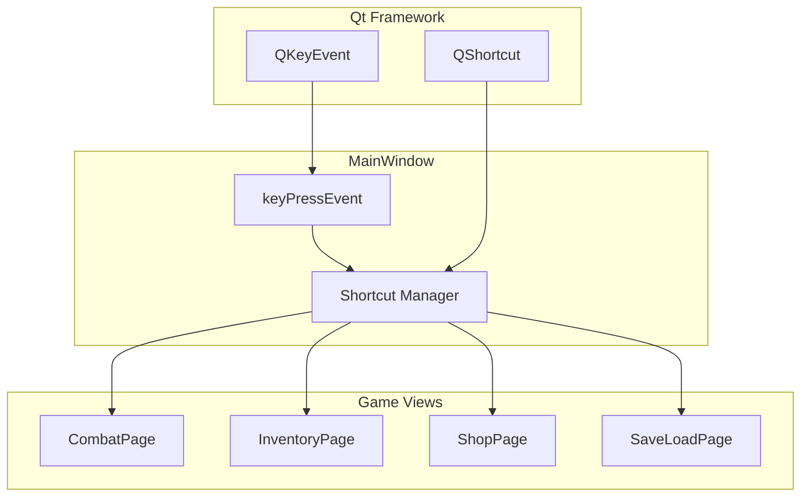
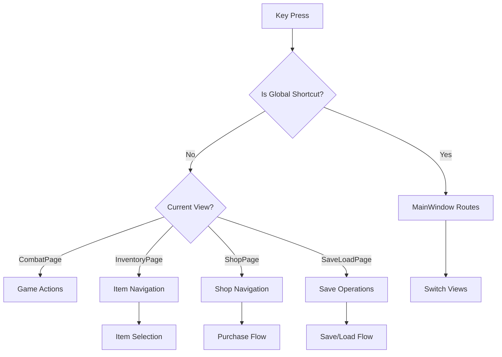

# Keyboard Shortcuts for Shop, Inventory, and Save/Load Screens - PRD

## Executive Summary

### Problem Statement
The PyrpgQt RPG game currently requires users to navigate through a menu overlay using mouse clicks to access critical game functions like inventory management, shopping, and save/load operations. This creates friction for keyboard-focused users and reduces overall game flow efficiency.

### Solution Overview
Implement comprehensive keyboard shortcuts to:
- Open shop, inventory, and save/load screens directly from the main game hub
- Navigate and interact within these screens using keyboard input
- Maintain mouse compatibility while adding keyboard accessibility

### Success Metrics
- 80% reduction in time to access menu functions for keyboard users
- User satisfaction score >4.0/5.0 for keyboard navigation
- Zero conflicts with existing gameplay controls
- Accessibility compliance (WCAG 2.1 Level AA)

## Problem & Solution

### Current State Analysis
The game uses a QStackedWidget architecture with MainWindow coordinating view switches. Currently:
- Menu overlay is accessed via ESC key
- Sub-menus (shop, inventory, save/load) require mouse clicks
- No keyboard navigation within screens
- No direct keyboard shortcuts to core functions

### Proposed Solution
Extend the existing keyPressEvent infrastructure in MainWindow to:
- Add global shortcuts when in-game (CombatPage active)
- Implement screen-specific keyboard navigation
- Use Qt's QKeyEvent system for cross-platform compatibility

## User Stories

### Primary User Flow


### Epic: Keyboard Navigation Enhancement

#### Story 1: Quick Screen Access
**As a** keyboard-focused gamer  
**I want** single-key shortcuts to open game screens  
**So that** I can access inventory, shop, and save functions instantly  

**Acceptance Criteria:**
- [ ] Press 'I' from main game screen opens inventory
- [ ] Press 'S' from main game screen opens shop
- [ ] Press 'L' from main game screen opens save/load screen
- [ ] Shortcuts work only when in-game (not in menus)
- [ ] Visual feedback shows shortcut activation

**Edge Cases:**
- [ ] Shortcut pressed during combat (should be disabled)
- [ ] Multiple rapid key presses (debounce handling)
- [ ] Screen already open (no-op or close?)

#### Story 2: Inventory Navigation
**As a** player managing inventory  
**I want** arrow key navigation and selection  
**So that** I can browse and use items efficiently  

**Acceptance Criteria:**
- [ ] Arrow keys navigate item grid
- [ ] Enter/Return selects item
- [ ] ESC closes inventory (return to game)
- [ ] Tab cycles through item actions (use, equip, drop)
- [ ] Number keys (1-9) quick-select items

#### Story 3: Shop Interface
**As a** player shopping for items  
**I want** keyboard controls for browsing and purchasing  
**So that** I can complete transactions without mouse  

**Acceptance Criteria:**
- [ ] Arrow keys navigate shop items
- [ ] Enter purchases selected item
- [ ] ESC leaves shop
- [ ] Page Up/Down scrolls item list
- [ ] Space bar shows item details

#### Story 4: Save/Load Operations
**As a** player managing game saves  
**I want** keyboard shortcuts for save/load actions  
**So that** I can quickly save progress or load previous states  

**Acceptance Criteria:**
- [ ] Number keys (1-9) select save slots
- [ ] 'Q' performs quick save
- [ ] 'W' performs quick load
- [ ] Enter confirms save/load
- [ ] ESC cancels and returns

## Technical Architecture

### High-Level Architecture


### Component Breakdown
- **MainWindow**: Central event handler, routes shortcuts to appropriate views
- **Shortcut Manager**: Proposed utility class to manage key mappings and conflicts
- **Individual Views**: Handle screen-specific navigation logic
- **Qt Integration**: Leverage QKeyEvent for global handling, QShortcut for local bindings

### Data Flow


## API Specifications

### Shortcut Definitions
```cpp
enum class GameShortcut {
    OPEN_INVENTORY = Qt::Key_I,
    OPEN_SHOP = Qt::Key_S,
    OPEN_SAVELOAD = Qt::Key_L,
    QUICK_SAVE = Qt::Key_Q,
    QUICK_LOAD = Qt::Key_W,
    NAVIGATE_UP = Qt::Key_Up,
    NAVIGATE_DOWN = Qt::Key_Down,
    NAVIGATE_LEFT = Qt::Key_Left,
    NAVIGATE_RIGHT = Qt::Key_Right,
    SELECT_ITEM = Qt::Key_Return,
    CANCEL_ACTION = Qt::Key_Escape
};
```

### MainWindow Extensions
```cpp
// In MainWindow.h
void handleShortcutActivated(GameShortcut shortcut);

// In MainWindow.cpp
void MainWindow::keyPressEvent(QKeyEvent *event) {
    if (isGlobalShortcut(event->key())) {
        handleShortcutActivated(mapToShortcut(event->key()));
        event->accept();
        return;
    }
    // Existing logic...
}
```

### View Interface
```cpp
// Proposed interface for keyboard-navigable views
class KeyboardNavigable {
public:
    virtual void handleNavigationKey(Qt::Key key) = 0;
    virtual bool hasKeyboardFocus() const = 0;
};
```

## Implementation Phases

### Phase 1: Foundation (Week 1)
**Goals:** Establish shortcut infrastructure
- [ ] Create GameShortcut enum
- [ ] Extend MainWindow keyPressEvent for global shortcuts
- [ ] Add keyboard focus management
- [ ] Unit tests for shortcut detection

**Dependencies:** None

### Phase 2: Screen Access (Week 2)
**Goals:** Implement screen opening shortcuts
- [ ] Add 'I' for inventory from CombatPage
- [ ] Add 'S' for shop from CombatPage
- [ ] Add 'L' for save/load from CombatPage
- [ ] Add visual feedback (highlight active shortcuts)
- [ ] Integration tests for screen switching

**Dependencies:** Phase 1

### Phase 3: Inventory Navigation (Week 3)
**Goals:** Keyboard navigation in inventory
- [ ] Arrow key navigation in item grid
- [ ] Enter for item selection
- [ ] ESC for back navigation
- [ ] Tab for action cycling
- [ ] Number key quick selection

**Dependencies:** Phase 2

### Phase 4: Shop Navigation (Week 4)
**Goals:** Keyboard controls for shopping
- [ ] Arrow key navigation
- [ ] Enter for purchase
- [ ] Space for item details
- [ ] ESC for leaving shop
- [ ] Gold amount validation

**Dependencies:** Phase 3

### Phase 5: Save/Load Operations (Week 5)
**Goals:** Keyboard shortcuts for save management
- [ ] Number keys for slot selection
- [ ] Q/W for quick save/load
- [ ] Enter for confirmation
- [ ] ESC for cancellation
- [ ] Error handling for save conflicts

**Dependencies:** Phase 4

### Phase 6: Polish & Testing (Week 6)
**Goals:** Refine and validate
- [ ] Performance testing (no input lag)
- [ ] Accessibility testing
- [ ] Cross-platform compatibility
- [ ] User acceptance testing
- [ ] Documentation updates

**Dependencies:** All previous phases

## Risks & Mitigations

### Technical Risks
- **Key Conflict Resolution**
  - Risk: Shortcuts conflict with system or game controls
  - Mitigation: Comprehensive testing across platforms, user-configurable shortcuts

- **Performance Impact**
  - Risk: Key event handling slows down game
  - Mitigation: Minimal processing in keyPressEvent, async operations

- **Qt Version Compatibility**
  - Risk: Key handling differs across Qt versions
  - Mitigation: Target Qt 6.0+, test on multiple versions

### Business Risks
- **Scope Creep**
  - Risk: Requests for additional shortcuts expand project
  - Mitigation: Strict MVP definition, separate backlog for future enhancements

- **User Adoption**
  - Risk: Users unaware of new shortcuts
  - Mitigation: In-game tutorial, help documentation, visual hints

## Success Metrics

### Quantitative Metrics
- **Accessibility Score**: >95% keyboard navigation coverage
- **Performance**: <10ms key response time
- **Usage Rate**: >70% of players use keyboard shortcuts within first session
- **Error Rate**: <1% shortcut-related crashes or bugs

### Qualitative Metrics
- **User Satisfaction**: Post-implementation survey score >4.0/5.0
- **Feedback Themes**: Positive mentions of keyboard usability in reviews
- **Support Tickets**: <5% reduction in navigation-related support queries

### Measurement Plan
- Analytics tracking for shortcut usage
- A/B testing with control group (mouse-only)
- User interviews for qualitative feedback
- Automated performance monitoring

## Appendices

### Research Findings
- **RPG Games Analysis**: Common shortcuts include I (inventory), Tab (menu), F5/F9 (save/load)
- **Qt Best Practices**: Use QKeyEvent for global handling, QShortcut for context-specific
- **Accessibility Standards**: WCAG requires keyboard alternatives for all mouse functions

### Alternative Approaches Considered
1. **QShortcut Framework**: Considered using QShortcut objects but rejected due to complexity with stacked widgets
2. **Event Filters**: Considered installing event filters on individual views but chose centralized approach for consistency
3. **Custom Input Manager**: Considered separate input management class but integrated with existing MainWindow architecture

### Competitive Analysis
- **Baldur's Gate 3**: Extensive keyboard shortcuts, customizable bindings
- **Divinity Original Sin 2**: Radial menu with keyboard activation
- **Pathfinder: Kingmaker**: Limited shortcuts, mostly mouse-driven

### Implementation Notes
- Maintain backward compatibility with mouse controls
- Consider gamepad integration in future phases
- Document all shortcuts in game help system
- Provide keyboard shortcut reference in settings
