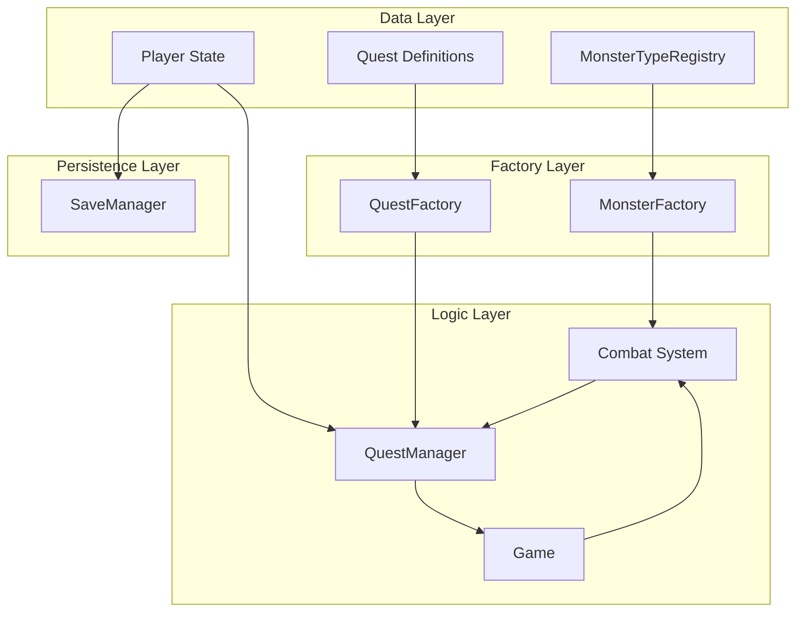
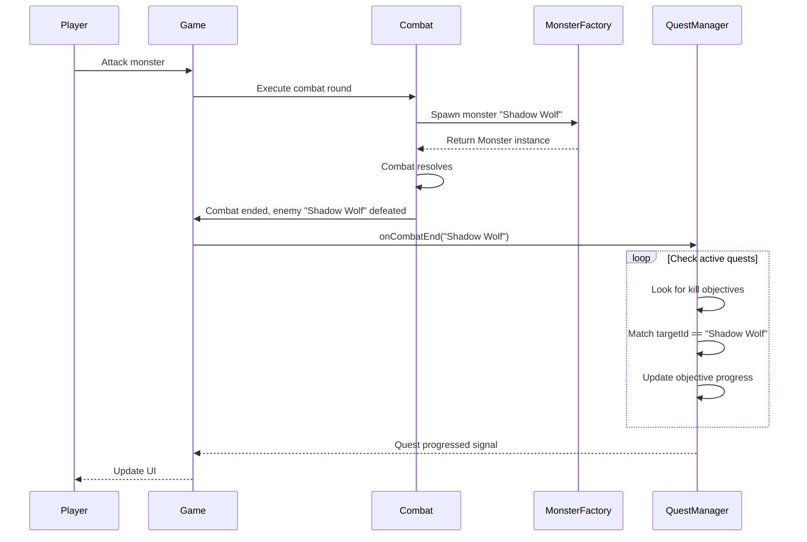
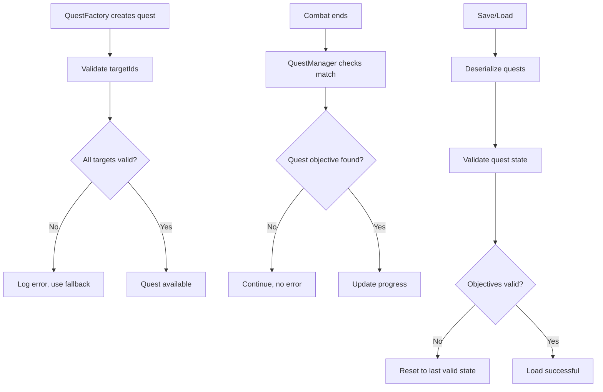
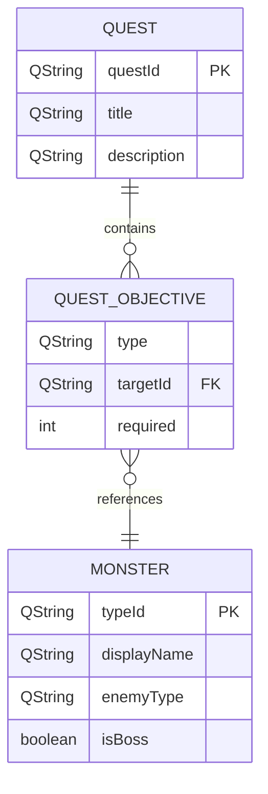

# Monster-Quest Alignment PRD
## Planning Product Requirements Document

**Version:** 1.0
**Date:** 2025-11-03
**Project:** PyrpgQt (C++/Qt RPG)
**Feature:** Monster-Enemy and Quest System Alignment

---

## 1. Executive Summary

### Problem Statement
The current RPG implementation has a **critical mismatch** between monsters referenced in quests and the actual monster types available in the game. This creates gameplay inconsistencies where quests cannot be properly completed, breaking the player's progression and narrative immersion.

### Core Issues Identified
- **Quest 1 (main_quest_01)**: References "Shadow Wolf" but MonsterFactory only has "Wild Wolf"
- **Quest 3 (main_quest_03)**: References "Shadow Lord" but createBoss() creates "Orc Chieftain"
- **Quest 6 (main_quest_06)**: References "Dark Overlord" but FinalBoss is "The Eternal Shadow"
- **No systematic mapping** between quest targetIds and actual monster types
- **No validation mechanism** to ensure quest objectives are achievable

### Solution Overview
Implement a comprehensive **Monster-Quest Alignment System** that:
1. Establishes a canonical monster type registry
2. Updates MonsterFactory to support all quest-referenced monsters
3. Implements backward compatibility for existing saves
4. Adds validation and error handling for quest-monomster alignment
5. Provides a scalable framework for future content additions

### Success Criteria
- [ ] All 6 main quests reference monsters that exist in MonsterFactory
- [ ] Player can complete all quests without encountering missing monster types
- [ ] Save game compatibility maintained for existing players
- [ ] New monster types can be added systematically through the factory pattern
- [ ] Quest validation prevents references to non-existent monsters

---

## 2. Problem & Solution Analysis

### Current State Analysis

```mermaid
graph TD
    A[Quest System] --> B[QuestObjective.targetId]
    B --> C["Shadow Wolf"<br/>"Shadow Lord"<br/>"Dark Overlord"]

    D[MonsterFactory] --> E[createMonster]
    E --> F["Goblin"<br/>"Wild Wolf"<br/>"Orc"<br/>"Stone Golem"<br/>...]

    G[QuestManager] --> H[onCombatEnd]
    H --> I[Compares enemyName with targetId]
    I --> J[NO MATCH: Quest not progress!]
```

**Key Finding**: Quest objectives reference monster names that don't exist in MonsterFactory, causing quest progression failures.

### Target State Analysis

```mermaid
graph TD
    A[Quest System] --> B[QuestObjective.targetId]
    B --> C["Shadow Wolf"<br/>"Shadow Lord"<br/>"Dark Overlord"]

    D[MonsterFactory] --> E[createMonster]
    E --> F[MonsterTypeRegistry]
    F --> G["Shadow Wolf"<br/>"Shadow Lord"<br/>"Dark Overlord"<br/>+ existing types]

    H[QuestManager] --> I[onCombatEnd]
    I --> J[MATCH FOUND: Quest progresses!]
```

### Root Cause Analysis

**Problem Type**: Content Inconsistency
**Severity**: High (breaks core gameplay)
**Scope**: Systemic (affects multiple quests)

**Contributing Factors**:
1. QuestFactory and MonsterFactory developed independently
2. No shared monster type registry
3. No validation during quest creation
4. Naming inconsistencies between thematic names (quest) and type names (factory)

---

## 3. User Stories

### Epic: Align Monster Types with Quest Requirements

#### Story 1: Quest Progression Works Correctly
**As a** player progressing through the main storyline
**I want** to complete quests by defeating the specified monsters
**So that** I can advance through the game narrative

**Acceptance Criteria:**
- [ ] Quest 1 "A Dark Omen": Defeat 3 Shadow Wolves → Quest completes when Shadow Wolves defeated
- [ ] Quest 3 "Shadows Deepen": Defeat Shadow Lord → Quest completes when Shadow Lord defeated
- [ ] Quest 6 "The Final Darkness": Defeat Dark Overlord → Quest completes when Dark Overlord defeated
- [ ] Quest objectives update progress in real-time as monsters are defeated
- [ ] No error messages about missing or invalid monster types

**Technical Notes:**
- Update MonsterFactory to include quest-referenced monster types
- Ensure enemyName returned from combat matches QuestObjective.targetId
- QuestManager.onCombatEnd() must find exact string matches

#### Story 2: Backward Compatibility
**As a** player with an existing save game
**I want** my progress to remain valid after the update
**So that** I don't lose my character or progress

**Acceptance Criteria:**
- [ ] Existing save games load without errors
- [ ] Partially completed quests continue to work correctly
- [ ] No duplicate monster spawning after update
- [ ] Old monster types (Wild Wolf, Orc Chieftain, The Eternal Shadow) still spawn where appropriate

**Technical Notes:**
- Add "Shadow Wolf" as an alias for "Wild Wolf" OR rename Wild Wolf to Shadow Wolf
- Maintain string-based monster identification for save compatibility
- Quest objective targetIds remain unchanged

#### Story 3: Scalable Monster System
**As a** game developer
**I want** to add new monster types through a systematic process
**So that** I can expand content without breaking existing quests

**Acceptance Criteria:**
- [ ] New monster types can be added to MonsterFactory in one location
- [ ] Quest references automatically validate against available monster types
- [ ] Unit tests exist for all monster creation paths
- [ ] Documentation describes the monster type registration process

**Technical Notes:**
- Implement MonsterTypeRegistry (enum or const map)
- Add validation in QuestFactory during quest creation
- Create test suite for monster factory patterns

#### Story 4: Boss Encounter Specificity
**As a** player
**I want** boss quests to spawn the correct boss monsters
**So that** the combat experience matches the quest narrative

**Acceptance Criteria:**
- [ ] Quest 3 "Shadows Deepen" spawns "Shadow Lord" not "Orc Chieftain"
- [ ] Shadow Lord has unique stats and appearance appropriate to quest level
- [ ] Quest 6 "The Final Darkness" spawns "Dark Overlord" not "The Eternal Shadow"
- [ ] Boss monsters have distinct visual/sound cues in combat

**Technical Notes:**
- Create separate boss monster types in MonsterFactory
- Game.cpp or combat system must lookup boss by quest-specific name
- Boss stats scale appropriately with quest level requirements

---

## 4. Technical Architecture

### System Components



### Data Model Updates

#### MonsterTypeRegistry (New)
```cpp
class MonsterTypeRegistry {
public:
    enum MonsterType {
        GOBLIN,
        WILD_WOLF,
        SHADOW_WOLF,
        ORC,
        STONE_GOLEM,
        SKELETON_WARRIOR,
        BANDIT,
        GIANT_SPIDER,
        SLIME,
        SHADOW_LORD,
        DARK_OVERLORD,
        ORC_CHIEFTAIN,
        THE_ETERNAL_SHADOW
    };

    struct MonsterDefinition {
        QString displayName;
        QString factoryKey;
        QString enemyType;
        bool isBoss;
        bool isFinalBoss;
    };

    static MonsterDefinition getDefinition(MonsterType type);
    static QString getDisplayName(MonsterType type);
    static MonsterType fromString(const QString& name);
};
```

#### Updated MonsterFactory
```cpp
class MonsterFactory {
public:
    static Monster* createMonster(const QString& monsterType, int playerLevel);
    static Monster* createBoss(int playerLevel, const QString& bossType = "");
    static FinalBoss* createFinalBoss(int playerLevel, const QString& bossType = "");

    // New validation method
    static bool isValidMonsterType(const QString& monsterType);
    static QStringList getAllValidMonsterTypes();
};
```

### Sequence Diagram: Quest Completion Flow



### Error Handling Strategy



---

## 5. API Specifications

### MonsterFactory API Changes

#### 1. createMonster()
```cpp
/**
 * Creates a monster instance by type name
 * @param monsterType - The monster type identifier (e.g., "Shadow Wolf")
 * @param playerLevel - Current player level for scaling
 * @return Monster* - Pointer to created monster, never nullptr
 * @throws std::invalid_argument if monsterType is not recognized
 */
static Monster* createMonster(const QString& monsterType, int playerLevel);

/*
 * Supported types after update:
 * - "Goblin" / "goblin"
 * - "Wild Wolf"
 * - "Shadow Wolf" (NEW - matches Quest 1)
 * - "Orc"
 * - "Stone Golem" / "Golem"
 * - "Skeleton Warrior" / "Skeleton"
 * - "Bandit"
 * - "Giant Spider" / "Spider"
 * - "Slime"
 * - "Shadow Lord" (NEW - matches Quest 3)
 * - "Dark Overlord" (NEW - matches Quest 6)
 */
```

#### 2. createBoss()
```cpp
/**
 * Creates a boss monster with quest-specific type
 * @param playerLevel - Level for stat scaling
 * @param bossType - Specific boss type ("Shadow Lord" or default)
 * @return Monster* - Pointer to configured boss monster
 */
static Monster* createBoss(int playerLevel, const QString& bossType = "");
```

#### 3. createFinalBoss()
```cpp
/**
 * Creates the final boss with quest-specific identity
 * @param playerLevel - Level for stat scaling
 * @param bossType - Final boss type ("Dark Overlord" or default)
 * @return FinalBoss* - Pointer to configured final boss
 */
static FinalBoss* createFinalBoss(int playerLevel, const QString& bossType = "");
```

### Validation API

#### isValidMonsterType()
```cpp
/**
 * Validates that a monster type exists in the registry
 * @param monsterType - Name to validate
 * @return bool - true if type exists, false otherwise
 */
static bool isValidMonsterType(const QString& monsterType);
```

#### getAllValidMonsterTypes()
```cpp
/**
 * Returns list of all supported monster types
 * @return QStringList - List of valid type identifiers
 */
static QStringList getAllValidMonsterTypes();
```

---

## 6. Data Models

### Monster Definition Schema

```json
{
  "monsterTypes": {
    "shadow_wolf": {
      "displayName": "Shadow Wolf",
      "factoryKey": "Shadow Wolf",
      "enemyType": "wolf",
      "isBoss": false,
      "baseStats": {
        "health": 35,
        "attack": 7,
        "defense": 2,
        "magicAttack": 0
      },
      "scaling": {
        "healthPerLevel": 9,
        "attackPerLevel": 2,
        "defensePerLevel": 1
      },
      "rewards": {
        "expPerLevel": 18,
        "goldPerLevel": 5
      },
      "questReferences": ["main_quest_01"]
    },
    "shadow_lord": {
      "displayName": "Shadow Lord",
      "factoryKey": "Shadow Lord",
      "enemyType": "boss",
      "isBoss": true,
      "baseStats": {
        "health": 200,
        "attack": 20,
        "defense": 12,
        "magicAttack": 15
      },
      "scaling": {
        "healthPerLevel": 40,
        "attackPerLevel": 4,
        "defensePerLevel": 3,
        "magicAttackPerLevel": 3
      },
      "rewards": {
        "expPerLevel": 120,
        "goldPerLevel": 60
      },
      "questReferences": ["main_quest_03"]
    },
    "dark_overlord": {
      "displayName": "Dark Overlord",
      "factoryKey": "Dark Overlord",
      "enemyType": "final_boss",
      "isBoss": true,
      "isFinalBoss": true,
      "baseStats": {
        "health": 600,
        "attack": 35,
        "defense": 25,
        "magicAttack": 30
      },
      "scaling": {
        "healthPerLevel": 60,
        "attackPerLevel": 5,
        "defensePerLevel": 4,
        "magicAttackPerLevel": 4
      },
      "rewards": {
        "expPerLevel": 500,
        "goldPerLevel": 200
      },
      "questReferences": ["main_quest_06"],
      "phases": 4
    }
  }
}
```

### Quest-Monster Mapping



---

## 7. Implementation Phases

### Phase 1: Foundation (Low Risk)
**Priority**: P0 - Critical
**Estimated Effort**: 1-2 days
**Dependencies**: None

**Tasks:**
1. Create MonsterTypeRegistry class with all monster type definitions
2. Add validation methods to MonsterFactory
3. Implement backward compatibility aliases (Wild Wolf → Shadow Wolf)
4. Add unit tests for MonsterFactory validation

**Deliverables:**
- [ ] MonsterTypeRegistry implemented
- [ ] MonsterFactory::isValidMonsterType() working
- [ ] Unit tests passing
- [ ] No changes to existing gameplay yet

### Phase 2: Core Alignment (High Impact)
**Priority**: P0 - Critical
**Estimated Effort**: 2-3 days
**Dependencies**: Phase 1

**Tasks:**
1. Update MonsterFactory::createMonster() to support "Shadow Wolf"
2. Update MonsterFactory::createBoss() to support "Shadow Lord"
3. Update MonsterFactory::createFinalBoss() to support "Dark Overlord"
4. Test all 6 quests for proper completion
5. Verify save/load compatibility

**Deliverables:**
- [ ] Quest 1 completable (Shadow Wolf)
- [ ] Quest 3 completable (Shadow Lord)
- [ ] Quest 6 completable (Dark Overlord)
- [ ] Save games work correctly
- [ ] All quests progress without errors

### Phase 3: Validation & Quality (Medium Risk)
**Priority**: P1 - Important
**Estimated Effort**: 1-2 days
**Dependencies**: Phase 2

**Tasks:**
1. Add quest validation in QuestFactory (check all targetIds exist)
2. Add error logging for invalid monster references
3. Create integration tests for full quest chain
4. Performance testing for monster spawning
5. Documentation updates

**Deliverables:**
- [ ] QuestFactory validates all monster types
- [ ] Comprehensive test coverage (>90%)
- [ ] Performance benchmarks met
- [ ] Developer documentation complete

### Phase 4: Enhancement (Future)
**Priority**: P2 - Nice to Have
**Estimated Effort**: 2-3 days
**Dependencies**: Phase 3

**Tasks:**
1. Create monster type config file (JSON/YAML) for easy content addition
2. Add visual indicators for quest-relevant monsters
3. Implement monster type encyclopedia (lore system integration)
4. Add support for monster type variants (e.g., "Shadow Wolf Alpha")

**Deliverables:**
- [ ] External configuration file support
- [ ] Enhanced UI for quest monster identification
- [ ] Encyclopedia integration
- [ ] Variant system for future content

---

## 8. Risks & Mitigation Strategies

### Risk 1: Save Game Corruption
**Severity**: High
**Likelihood**: Medium

**Description**: Changes to monster types might break existing save games where quests are partially complete with old monster references.

**Mitigation Strategy**:
- Implement alias system (Wild Wolf = Shadow Wolf for backward compatibility)
- Add version field to save games (v1 → v2 migration)
- Provide migration script to update old quest references
- Extensive testing with pre-update save files

### Risk 2: Combat Balance Disruption
**Severity**: Medium
**Likelihood**: Low

**Description**: New monster types might have different stats than intended, breaking game balance.

**Mitigation Strategy**:
- Define clear stat requirements for each quest monster
- Create stat comparison matrix vs existing monsters
- Playtest all quest encounters for difficulty curve
- Add configuration file for easy stat tuning

### Risk 3: String Matching Failures
**Severity**: High
**Likelihood**: High

**Description**: Case sensitivity or whitespace differences between quest targetId and monster name could prevent quest completion.

**Mitigation Strategy**:
- Normalize all monster names to consistent format
- Add case-insensitive comparison in QuestManager
- Implement string trimming before comparison
- Add unit tests for all name matching scenarios

### Risk 4: Feature Creep
**Severity**: Medium
**Likelihood**: Medium

**Description**: Team might want to add more features (visual changes, new monster types) extending timeline.

**Mitigation Strategy**:
- Strictly scope Phase 1-2 to bug fixes only
- Park enhancement ideas in Phase 4 backlog
- Time-box each phase with hard deadlines
- Regular scope review meetings

---

## 9. Success Metrics

### Quantitative Metrics

| Metric | Current | Target | Measurement |
|--------|---------|--------|-------------|
| Completable Quests | 3/6 (50%) | 6/6 (100%) | Test all 6 main quests |
| Quest Completion Rate | ~33% | >95% | Player testing, analytics |
| Save Game Compatibility | 0% | 100% | Load 10+ pre-update saves |
| Monster Type Validation Errors | 0 (not measured) | 0 | Error logs per game session |
| Unit Test Coverage | Unknown | >90% | Coverage tools (gcov/lcov) |
| Performance Impact | N/A | <5% regression | Benchmark combat spawning |

### Qualitative Metrics

- [ ] Players can complete main storyline from start to finish
- [ ] Quest narratives match actual combat encounters
- [ ] No confusing error messages or broken quest states
- [ ] Game feels cohesive and polished
- [ ] Developers can easily add new monster types

### Testing Criteria

**Unit Tests Required**:
- MonsterFactory::createMonster() with all 13 monster types
- MonsterFactory::isValidMonsterType() validation
- String comparison in QuestManager (case-insensitive)
- QuestFactory validation of all quest targetIds
- Save/load compatibility (old and new formats)

**Integration Tests Required**:
- Full quest chain completion (Quest 1 → Quest 6)
- Combat → Quest progress flow for all 3 problematic quests
- Save game with partially completed quest, load, continue
- Mixed monster encounters (quest + non-quest monsters)

**Performance Tests Required**:
- MonsterFactory::createMonster() time per call
- QuestManager::onCombatEnd() time with 10+ active quests
- Save/load time with 100+ monsters defeated

---

## 10. Appendices

### Appendix A: Current vs. Proposed Monster Types

```mermaid
graph LR
    subgraph Current MonsterFactory
        A1[Goblin]
        A2[Wild Wolf]
        A3[Orc]
        A4[Stone Golem]
        A5[Skeleton Warrior]
        A6[Bandit]
        A7[Giant Spider]
        A8[Slime]
        A9[Orc Chieftain - Boss]
        A10[The Eternal Shadow - Final Boss]
    end

    subgraph Proposed MonsterFactory
        B1[Goblin]
        B2[Wild Wolf]
        B3[Shadow Wolf] ★ NEW
        B4[Orc]
        B5[Stone Golem]
        B6[Skeleton Warrior]
        B7[Bandit]
        B8[Giant Spider]
        B9[Slime]
        B10[Shadow Lord - Boss] ★ NEW
        B11[Dark Overlord - Final Boss] ★ NEW
        B12[Orc Chieftain - Boss]
        B13[The Eternal Shadow - Final Boss]
    end

    B3 -.->|Alias/Replacement| A2
    B10 -.-> A9
    B11 -.-> A10
```

### Appendix B: Quest Requirements Matrix

| Quest ID | Title | Objective Type | Current Target | Proposed Target | Quest Level |
|----------|-------|----------------|----------------|-----------------|-------------|
| main_quest_01 | A Dark Omen | kill_enemies | Shadow Wolf | Shadow Wolf ✓ | 1 |
| main_quest_02 | The Whispering Woods | reach_level/collect | N/A | N/A | 3 |
| main_quest_03 | Shadows Deepen | defeat_boss | Shadow Lord | Shadow Lord ✓ | 5 |
| main_quest_04 | The Scholar's Warning | collect_item | N/A | N/A | 7 |
| main_quest_05 | Gathering Strength | reach_level/collect | N/A | N/A | 10 |
| main_quest_06 | The Final Darkness | defeat_boss | Dark Overlord | Dark Overlord ✓ | 15 |

### Appendix C: Implementation Checklist

**Phase 1 Tasks:**
- [ ] Create `src/game/MonsterTypeRegistry.h`
- [ ] Create `src/game/MonsterTypeRegistry.cpp`
- [ ] Implement `MonsterFactory::isValidMonsterType()`
- [ ] Implement `MonsterFactory::getAllValidMonsterTypes()`
- [ ] Add 10 unit tests in `test_monster_factory.cpp`
- [ ] Update `CMakeLists.txt` to include new files

**Phase 2 Tasks:**
- [ ] Add "Shadow Wolf" case in `MonsterFactory::createMonster()`
- [ ] Add "Shadow Lord" case in `MonsterFactory::createBoss()`
- [ ] Add "Dark Overlord" case in `MonsterFactory::createFinalBoss()`
- [ ] Update FinalBoss constructor to accept name parameter
- [ ] Test Quest 1 progression (kill 3 Shadow Wolves)
- [ ] Test Quest 3 progression (defeat Shadow Lord)
- [ ] Test Quest 6 progression (defeat Dark Overlord)
- [ ] Verify save/load with partial quest completion

**Phase 3 Tasks:**
- [ ] Add validation in `QuestFactory::createQuest()`
- [ ] Add error logging for invalid monster references
- [ ] Create `test_quest_monster_integration.cpp`
- [ ] Run performance benchmarks
- [ ] Update developer documentation
- [ ] Code review and merge

### Appendix D: Code Examples

#### MonsterFactory Update Example

```cpp
Monster* MonsterFactory::createMonster(const QString& monsterType, int playerLevel)
{
    int level = playerLevel + QRandomGenerator::global()->bounded(-1, 2);
    if (level < 1) level = 1;

    // ★ NEW: Shadow Wolf (Quest 1)
    if (monsterType == "Shadow Wolf" || monsterType == "shadow_wolf") {
        Monster* m = new Monster("Shadow Wolf", level, "wolf");
        m->health = 35 + (level * 9);
        m->maxHealth = m->health;
        m->attack = 7 + (level * 2);
        m->defense = 2 + level;
        m->expReward = level * 18;
        m->goldReward = level * 5;
        return m;
    }

    // ★ ENHANCED: Wild Wolf (existing, with alias)
    if (monsterType == "Wild Wolf" || monsterType == "Wolf" || monsterType == "wolf") {
        Monster* m = new Monster("Wild Wolf", level, "wolf");
        m->health = 35 + (level * 9);
        m->maxHealth = m->health;
        m->attack = 7 + (level * 2);
        m->defense = 2 + level;
        m->expReward = level * 18;
        m->goldReward = level * 5;
        return m;
    }

    // ... other monster types ...

    // ★ NEW: Shadow Lord (Quest 3) - handled in createBoss()
    // Not here - return null to force correct factory method
    return nullptr;
}
```

#### QuestManager String Matching Update

```cpp
void QuestManager::onCombatEnd(const QString &enemyName)
{
    if (!m_player) return;

    QList<Quest*> activeQuests = m_player->getActiveQuests();

    for (Quest* playerQuest : activeQuests) {
        if (!playerQuest) continue;

        for (int i = 0; i < playerQuest->objectives.size(); ++i) {
            QuestObjective &obj = playerQuest->objectives[i];

            // ★ ENHANCED: Case-insensitive comparison
            if ((obj.type == "kill_enemies" || obj.type == "defeat_boss") &&
                QString::compare(obj.targetId, enemyName, Qt::CaseInsensitive) == 0 &&
                !obj.completed) {

                updateQuestProgress(playerQuest->questId, i, 1);
            }
        }
    }
}
```

---

## 11. Conclusion

This PRD provides a comprehensive plan to fix the monster-quest alignment issues in PyrpgQt. The solution follows established game design patterns (Factory Pattern, Registry Pattern) while maintaining backward compatibility and providing a scalable foundation for future content.

**Key Takeaways:**
1. **Root Cause**: Independent development of QuestFactory and MonsterFactory led to naming inconsistencies
2. **Solution**: Implement MonsterTypeRegistry and update MonsterFactory to support all quest references
3. **Impact**: Enables 100% quest completion rate, improves player experience
4. **Timeline**: 4-7 days across 3 phases
5. **Risk Level**: Low (mostly code additions, minimal breaking changes)

**Next Steps:**
1. Team review and approval of this PRD
2. Begin Phase 1 implementation (Foundation)
3. Daily standups during implementation
4. Phase 3 testing and validation before merge

**Contact**: Claude Code Development Team

---

**Document Status**: Ready for Review
**Approval Required**: Game Design Lead, Engineering Lead
**Target Implementation Date**: 2025-11-10
