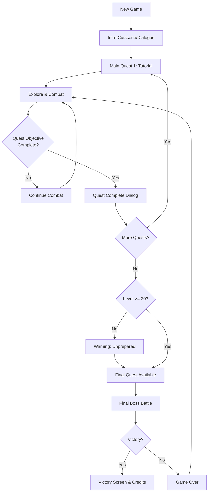
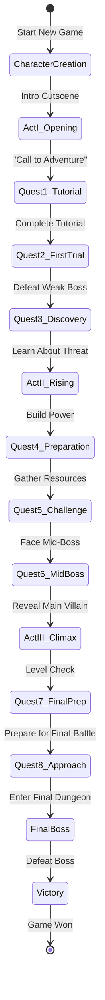
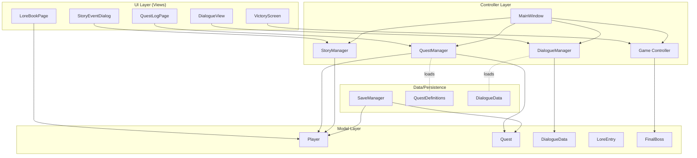
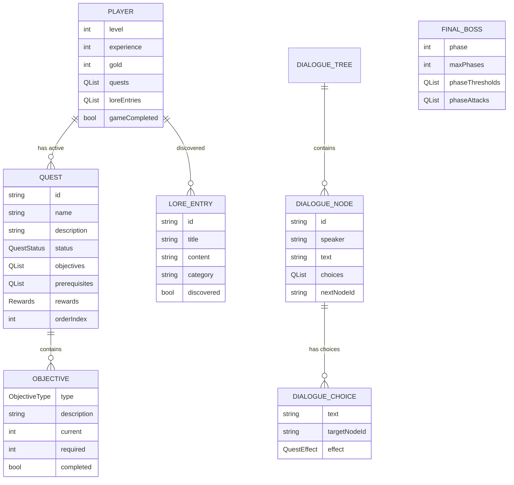
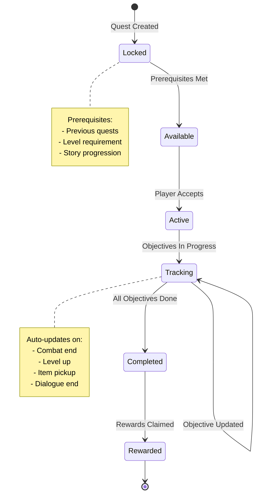
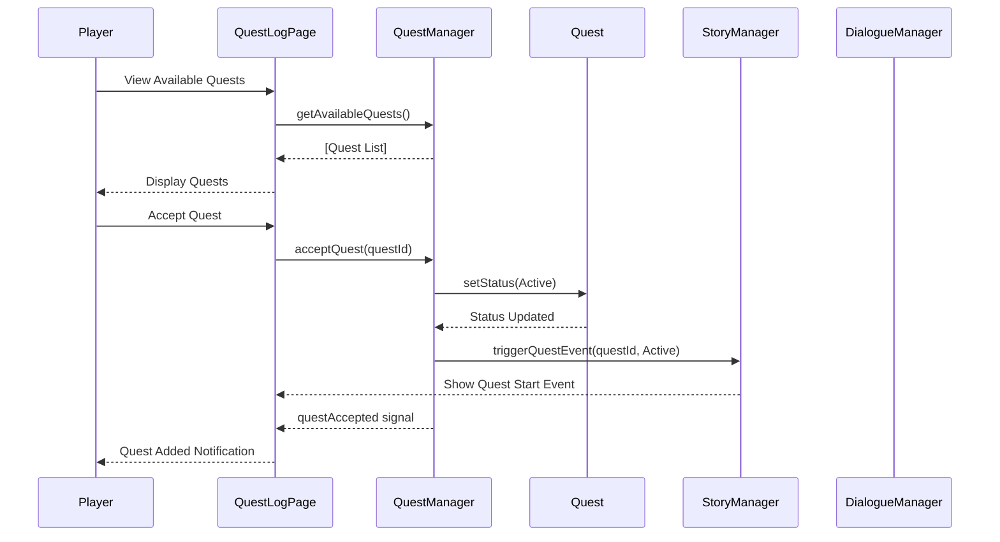
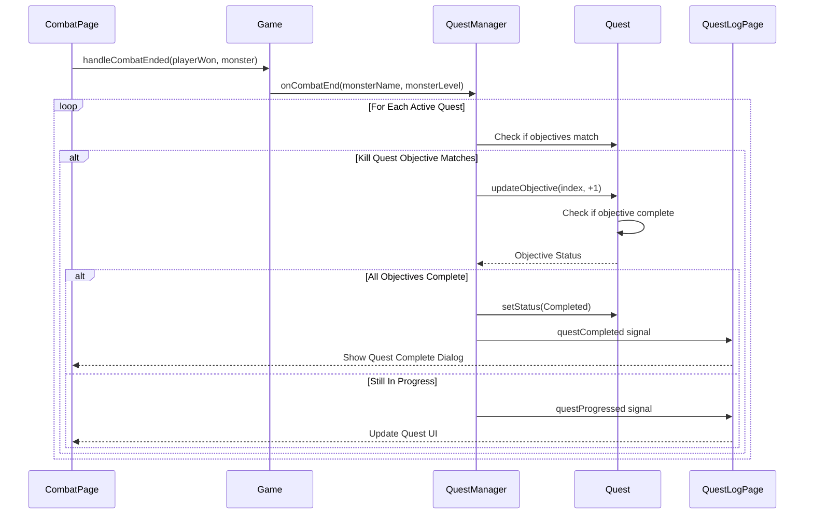
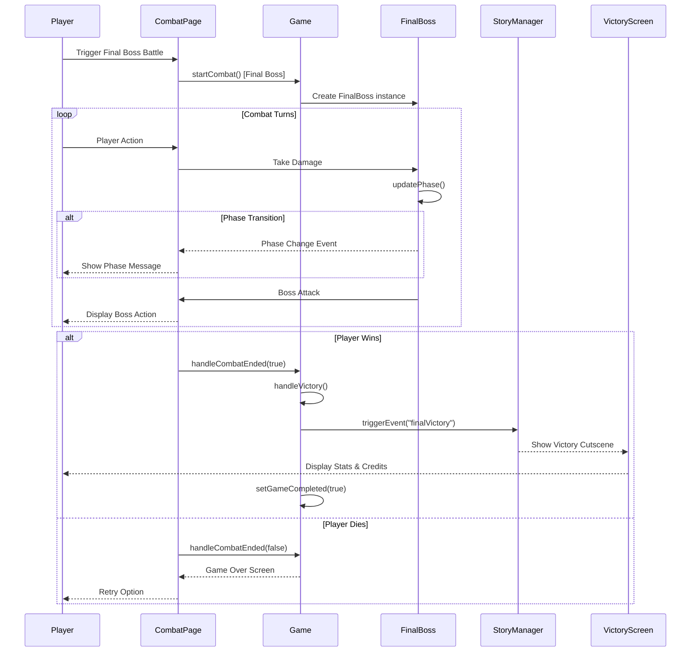
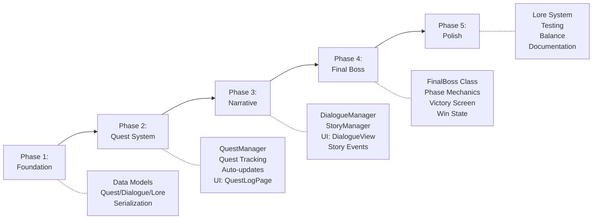

# Storyline & Quest System PRD
## Product Requirements Document for PyRPG Qt

**Version:** 1.0
**Date:** 2025-10-30
**Status:** Planning - Ready for Implementation
**Author:** Planning PRP

---

## Executive Summary

### Problem Statement

PyRPG Qt currently lacks a narrative framework and win condition. Players engage in endless combat without story context, clear progression goals, or sense of accomplishment. The game needs:

1. **Narrative Context**: Players don't understand why they're fighting or what their purpose is
2. **Win Condition**: No way to "beat" the game - endless grinding without closure
3. **Player Engagement**: Limited immersion due to lack of story-driven motivation
4. **Progression Clarity**: No clear milestones beyond leveling up

### Solution Overview

Implement a **Linear Main Quest System** with:

- **Quest Framework**: Extensible quest data model with tracking and persistence
- **Storyline Engine**: 5-10 main story quests with narrative progression
- **Dialogue System**: NPC conversations with branching options
- **Event System**: Text-based story events at key moments (cutscenes)
- **Lore Integration**: World-building through item descriptions and readable content
- **Final Boss**: Climactic encounter requiring level 20+ to access
- **Win Condition**: Story completion with end-game state and victory screen

### Success Metrics

**Player Engagement:**
- 70%+ of new players complete at least 3 story quests
- Average session time increases by 30%+
- Player retention increases through story hooks

**Technical Quality:**
- Quest system fully integrated with save/load
- Zero quest progression bugs in testing
- Performance impact < 5ms per quest check

**Story Experience:**
- 80%+ positive sentiment on story engagement (if collecting feedback)
- Clear sense of progression and accomplishment
- Satisfying victory experience

---

## User Stories & Scenarios

### Primary User Flows



### Story Progression Flow



### Epic 1: Core Quest System

#### Story 1.1: Quest Tracking
**As a** player
**I want to** see my active quests and objectives
**So that** I know what to do next and track my progress

**Acceptance Criteria:**
- [ ] Quest log accessible from main menu (Q key)
- [ ] Active quest shows objective text and progress
- [ ] Completed quests marked with checkmark
- [ ] Quest descriptions readable and clear
- [ ] Quest rewards displayed (XP, gold, items)

**Edge Cases:**
- Multiple active quests at once
- Quest completion while player dead
- Quest progress during combat

**Technical Notes:**
- New `Quest` model with serialization support
- `QuestManager` to track state
- UI page: `QuestLogPage`

---

#### Story 1.2: Quest Progression
**As a** player
**I want** quests to automatically progress when I complete objectives
**So that** I experience a seamless story flow

**Acceptance Criteria:**
- [ ] Kill X enemies: Updates automatically after combat
- [ ] Reach level X: Checks on level up
- [ ] Collect item: Triggers when item added to inventory
- [ ] Talk to NPC: Advances on dialogue completion
- [ ] Quest completion shows dialog/event

**Edge Cases:**
- Objective completed during unsaved session
- Quest item lost/sold before completion
- Level requirement met before quest accepted

**Technical Notes:**
- Event-driven quest updates via signals
- Quest objective types enum
- Progress tracking with current/required counts

---

### Epic 2: Narrative Experience

#### Story 2.1: Dialogue System
**As a** player
**I want to** have conversations with NPCs
**So that** I can learn about the world and advance the story

**Acceptance Criteria:**
- [ ] NPC dialogue displays in modal dialog
- [ ] Player can choose from 2-4 response options
- [ ] Some responses affect quest state or rewards
- [ ] Dialogue history viewable
- [ ] "Continue" advances linear dialogue

**Edge Cases:**
- Dialogue during combat (shouldn't happen)
- NPC not found (quest giver removed)
- Dialogue choices that don't affect outcome

**Technical Notes:**
- `DialogueManager` with node-based dialogue trees
- `DialogueData` structure: speaker, text, choices
- Optional branching with consequence tracking

---

#### Story 2.2: Story Events (Cutscenes)
**As a** player
**I want** important story moments presented dramatically
**So that** I feel engaged with the narrative

**Acceptance Criteria:**
- [ ] Story events display in overlay/full-screen
- [ ] Text appears with typing effect or fade-in
- [ ] Background image sets the scene
- [ ] Player clicks to advance or auto-advances
- [ ] Events trigger at quest milestones

**Edge Cases:**
- Event triggered during combat
- Player skips too quickly
- Save during event playback

**Technical Notes:**
- `StoryEventDialog` component
- Event data: text, background, timing
- Queue system for sequential events

---

#### Story 2.3: Lore & World-Building
**As a** player
**I want to** discover lore through items and locations
**So that** the world feels rich and immersive

**Acceptance Criteria:**
- [ ] Item descriptions include lore hints
- [ ] "Lore" section in menu shows discovered lore
- [ ] Key items have extended descriptions
- [ ] Location names and descriptions visible

**Edge Cases:**
- Lore item never found
- Lore entry unlocked multiple times
- Lore contradictions

**Technical Notes:**
- Extended `Item` descriptions
- `LoreEntry` model with unlock tracking
- `LoreBookPage` UI view

---

### Epic 3: Win Condition & Final Boss

#### Story 3.1: Final Quest Unlock
**As a** player
**I want** the final quest to unlock only when I'm prepared
**So that** I'm not overwhelmed and have a challenging conclusion

**Acceptance Criteria:**
- [ ] Final quest requires all story quests complete
- [ ] Level 20+ required to access final boss area
- [ ] Warning dialog if player under-leveled
- [ ] "Point of no return" indicator before final battle

**Edge Cases:**
- Player exactly level 20 (should allow)
- Player loads save before final quest
- All quests complete but level too low

**Technical Notes:**
- Quest prerequisite checking
- Level gate in quest unlock logic
- UI indicators for locked content

---

#### Story 3.2: Final Boss Battle
**As a** player
**I want** an epic final boss fight
**So that** I have a satisfying challenge and climax

**Acceptance Criteria:**
- [ ] Unique, powerful boss with 3-phase mechanics
- [ ] Boss health bar displays all phases
- [ ] Special attacks/patterns in each phase
- [ ] Dramatic intro event before battle
- [ ] Defeat leads to victory screen

**Edge Cases:**
- Player dies to final boss (can retry)
- Player runs from final boss (can re-enter)
- Player under-equipped despite level requirement

**Technical Notes:**
- `FinalBoss` class extends `Monster`
- Phase tracking in boss state
- Special combat logic for phases
- Victory flag persisted to save

---

#### Story 3.3: Victory & Endgame
**As a** player
**I want** a rewarding ending sequence
**So that** I feel accomplished and have closure

**Acceptance Criteria:**
- [ ] Victory cutscene plays after final boss
- [ ] Stats displayed: playtime, level, kills, deaths
- [ ] "You Win!" screen with celebratory art
- [ ] Option to continue playing (post-game)
- [ ] Save marked as "Game Completed"

**Edge Cases:**
- Player closes game during ending
- Multiple victories (New Game+)

**Technical Notes:**
- `VictoryScreen` UI page
- Game statistics tracking
- "Completed" flag in save data

---

## System Architecture

### High-Level Component Architecture



### Data Model Relationships



### Quest State Machine



---

## Technical Specifications

### Quest System Architecture

#### Quest Model (`src/models/Quest.h`)

```cpp
enum class QuestStatus {
    Locked,
    Available,
    Active,
    Completed,
    Rewarded
};

enum class ObjectiveType {
    KillEnemies,
    ReachLevel,
    CollectItem,
    TalkToNPC,
    DefeatBoss,
    ExploreLocation
};

struct QuestObjective {
    ObjectiveType type;
    QString description;
    QString targetId;  // monster name, item name, NPC id, etc.
    int required;
    int current;
    bool completed;
};

struct QuestRewards {
    int experience;
    int gold;
    QList<Item*> items;
};

class Quest {
public:
    QString id;
    QString name;
    QString description;
    QString longDescription;
    QuestStatus status;

    QList<QuestObjective> objectives;
    QList<QString> prerequisiteQuestIds;
    int minimumLevel;
    int orderIndex;

    QuestRewards rewards;

    bool arePrerequisitesMet(const Player* player) const;
    bool isAvailable(const Player* player) const;
    void updateObjective(int objectiveIndex, int progress);
    bool isComplete() const;

    // Serialization
    friend QDataStream &operator<<(QDataStream &out, const Quest &q);
    friend QDataStream &operator>>(QDataStream &in, Quest &q);
};
```

#### Quest Manager (`src/game/QuestManager.h`)

```cpp
class QuestManager : public QObject {
    Q_OBJECT

public:
    explicit QuestManager(Player* player, QObject* parent = nullptr);

    void loadQuestDefinitions();
    Quest* getQuestById(const QString& questId);
    QList<Quest*> getActiveQuests() const;
    QList<Quest*> getAvailableQuests() const;
    QList<Quest*> getCompletedQuests() const;

    bool acceptQuest(const QString& questId);
    void updateQuestProgress(const QString& questId, int objectiveIndex, int progress);
    void completeQuest(const QString& questId);

    // Auto-update triggers
    void onCombatEnd(const QString& enemyName, int enemyLevel);
    void onLevelUp(int newLevel);
    void onItemCollected(const QString& itemName);
    void onDialogueEnd(const QString& npcId);

signals:
    void questAvailable(const QString& questId);
    void questAccepted(const QString& questId);
    void questProgressed(const QString& questId, int objectiveIndex);
    void questCompleted(const QString& questId);

private:
    Player* m_player;
    QList<Quest*> m_allQuests;
    QMap<QString, Quest*> m_questMap;

    void checkQuestUnlocks();
    void triggerQuestEvent(const QString& questId);
};
```

### Dialogue System Architecture

#### Dialogue Model (`src/models/DialogueData.h`)

```cpp
enum class DialogueEffectType {
    None,
    AdvanceQuest,
    GiveItem,
    GiveGold,
    GiveXP,
    UnlockQuest
};

struct DialogueEffect {
    DialogueEffectType type;
    QString target;  // quest id, item name, etc.
    int value;       // amount of gold/xp
};

struct DialogueChoice {
    QString text;
    QString targetNodeId;
    QList<DialogueEffect> effects;
    bool requiresLevel;
    int requiredLevel;
};

struct DialogueNode {
    QString id;
    QString speaker;
    QString text;
    QList<DialogueChoice> choices;
    QString autoNextNodeId;  // For linear dialogue
    bool endsDialogue;
};

class DialogueTree {
public:
    QString id;
    QString npcName;
    QString startNodeId;
    QMap<QString, DialogueNode> nodes;

    DialogueNode* getNode(const QString& nodeId);
    DialogueNode* getStartNode();
};
```

#### Dialogue Manager (`src/game/DialogueManager.h`)

```cpp
class DialogueManager : public QObject {
    Q_OBJECT

public:
    void loadDialogueTrees();
    void startDialogue(const QString& treeId);
    DialogueNode* getCurrentNode();
    void selectChoice(int choiceIndex);
    void advance();  // For linear dialogue

signals:
    void dialogueStarted(const QString& npcName);
    void dialogueNodeChanged(const DialogueNode* node);
    void dialogueEnded();
    void effectTriggered(const DialogueEffect& effect);

private:
    QMap<QString, DialogueTree*> m_trees;
    DialogueTree* m_currentTree;
    DialogueNode* m_currentNode;
    Player* m_player;

    void applyEffect(const DialogueEffect& effect);
};
```

### Story Event System

#### Story Event Model (`src/models/StoryEvent.h`)

```cpp
struct StoryEvent {
    QString id;
    QString title;
    QString text;
    QString backgroundImage;
    int displayDurationMs;
    bool requiresClick;
};
```

#### Story Manager (`src/game/StoryManager.h`)

```cpp
class StoryManager : public QObject {
    Q_OBJECT

public:
    void loadStoryEvents();
    void triggerEvent(const QString& eventId);
    void triggerQuestEvent(const QString& questId, QuestStatus status);

signals:
    void eventTriggered(const StoryEvent& event);

private:
    QMap<QString, StoryEvent> m_events;
    QMap<QString, QList<StoryEvent>> m_questEvents;
};
```

### Final Boss System

#### Final Boss Model (`src/models/FinalBoss.h`)

```cpp
class FinalBoss : public Monster {
public:
    FinalBoss();

    int currentPhase;
    int maxPhases;
    QList<int> phaseHealthThresholds;  // HP % for each phase
    QMap<int, QList<QString>> phaseAttacks;  // Attacks per phase

    void updatePhase();
    QString getPhaseDescription() const;
    bool shouldTransitionPhase() const;

    // Override attack behavior for phases
    QString performAttack(Player* target) override;
};
```

### API/Integration Points

#### Game Controller Integration

```cpp
// In Game class (src/game/Game.h)
class Game : public QObject {
    // ... existing code ...

    QuestManager* getQuestManager();
    DialogueManager* getDialogueManager();
    StoryManager* getStoryManager();

    void triggerFinalBossEncounter();
    bool canAccessFinalBoss() const;
    void handleVictory();

private:
    QuestManager* m_questManager;
    DialogueManager* m_dialogueManager;
    StoryManager* m_storyManager;
    bool m_gameCompleted;
};
```

#### Save System Integration

```cpp
// SaveManager additions
bool SaveManager::saveGame(Player* player, const QString& filePath) {
    // ... existing code ...

    // Save quest data
    QList<Quest*> quests = player->getQuests();
    out << quests.size();
    for (Quest* quest : quests) {
        out << *quest;
    }

    // Save lore entries
    QList<LoreEntry*> lore = player->getLoreEntries();
    out << lore.size();
    for (LoreEntry* entry : lore) {
        out << *entry;
    }

    // Save game completion flag
    out << player->isGameCompleted();

    return true;
}
```

### Sequence Diagrams

#### Quest Acceptance Flow



#### Combat Quest Progress Update



#### Final Boss Victory Flow



---

## Implementation Strategy

### Development Phases



### Phase 1: Foundation (Week 1)

**Goal:** Create core data models and infrastructure

**Tasks:**
1. Create `Quest` model with serialization
2. Create `DialogueNode`, `DialogueTree` models
3. Create `LoreEntry` model
4. Create `StoryEvent` struct
5. Update `Player` to include:
   - `QList<Quest*> quests`
   - `QList<LoreEntry*> loreEntries`
   - `bool gameCompleted`
6. Update `SaveManager` to serialize quest/lore data
7. Write unit tests for models

**Deliverables:**
- [ ] `src/models/Quest.h/cpp`
- [ ] `src/models/DialogueData.h/cpp`
- [ ] `src/models/LoreEntry.h/cpp`
- [ ] `src/models/StoryEvent.h`
- [ ] Updated `src/models/Player.h/cpp`
- [ ] Updated `src/persistence/SaveManager.h/cpp`
- [ ] `tests/test_quest_models.cpp`

**Dependencies:** None

---

### Phase 2: Quest System (Week 2)

**Goal:** Implement quest tracking and progression

**Tasks:**
1. Create `QuestManager` class
2. Implement quest state management
3. Create quest definition loader (JSON or hardcoded)
4. Integrate quest updates with game events:
   - Combat end
   - Level up
   - Item collection
5. Create `QuestLogPage` UI
6. Add quest notifications/dialogs
7. Write integration tests

**Deliverables:**
- [ ] `src/game/QuestManager.h/cpp`
- [ ] `src/game/factories/QuestFactory.h/cpp`
- [ ] `src/views/QuestLogPage.h/cpp`
- [ ] `src/components/QuestNotificationDialog.h/cpp`
- [ ] Quest definitions file (hardcoded or JSON)
- [ ] Updated `src/MainWindow` with quest log navigation
- [ ] `tests/test_quest_system.cpp`

**Dependencies:** Phase 1

---

### Phase 3: Narrative Systems (Week 2-3)

**Goal:** Implement dialogue, events, and lore

**Tasks:**
1. Create `DialogueManager` class
2. Create `StoryManager` class
3. Create `DialogueView` UI component
4. Create `StoryEventDialog` overlay
5. Create `LoreBookPage` UI
6. Write 5-10 main story quests with dialogue
7. Implement event triggers at quest milestones
8. Add lore to items and create lore entries

**Deliverables:**
- [ ] `src/game/DialogueManager.h/cpp`
- [ ] `src/game/StoryManager.h/cpp`
- [ ] `src/views/DialogueView.h/cpp`
- [ ] `src/components/StoryEventDialog.h/cpp`
- [ ] `src/views/LoreBookPage.h/cpp`
- [ ] Story quest definitions
- [ ] Dialogue tree definitions
- [ ] Story event definitions
- [ ] Lore entry definitions
- [ ] `tests/test_dialogue_system.cpp`

**Dependencies:** Phase 2

---

### Phase 4: Final Boss & Win Condition (Week 3-4)

**Goal:** Implement endgame content

**Tasks:**
1. Create `FinalBoss` class with phase mechanics
2. Implement final quest chain
3. Create level gate (20+) for final boss
4. Implement boss battle with 3 phases
5. Create `VictoryScreen` UI
6. Implement game completion tracking
7. Add "Point of No Return" warning dialog
8. Create victory cutscene/event
9. Display end-game statistics

**Deliverables:**
- [ ] `src/models/FinalBoss.h/cpp`
- [ ] `src/views/VictoryScreen.h/cpp`
- [ ] Final quest definitions
- [ ] Victory event/cutscene
- [ ] Updated `Game` with victory logic
- [ ] Updated save system with completion flag
- [ ] `tests/test_final_boss.cpp`

**Dependencies:** Phase 3

---

### Phase 5: Polish & Integration (Week 4)

**Goal:** Complete lore system, testing, and polish

**Tasks:**
1. Add lore to all relevant items
2. Create 10-15 lore entries
3. Implement lore discovery notifications
4. Comprehensive testing:
   - Quest progression edge cases
   - Save/load with quest state
   - Dialogue branching
   - Final boss phases
5. Balance final boss difficulty
6. Polish UI/UX for all new pages
7. Update documentation (CLAUDE.md)
8. Create player-facing documentation

**Deliverables:**
- [ ] Complete lore content
- [ ] Full test suite passing
- [ ] Balanced final boss
- [ ] Polished UI
- [ ] Updated documentation
- [ ] Integration tests

**Dependencies:** Phase 4

---

## Implementation Priority Matrix

### Must Have (MVP)
1. Quest data model with serialization
2. QuestManager with tracking
3. QuestLogPage UI
4. 5 main story quests (hardcoded)
5. Basic dialogue system (linear only)
6. FinalBoss class
7. Victory screen
8. Win condition (level 20 + all quests)

### Should Have (Standard)
9. Branching dialogue choices
10. Story events at quest milestones
11. Quest notification system
12. Lore system basics
13. 10 main story quests
14. Boss phase mechanics (3 phases)
15. End-game statistics

### Nice to Have (Polish)
16. Advanced lore book UI
17. Animated story events
18. Quest waypoint indicators
19. NPC portraits in dialogue
20. Achievement tracking
21. New Game+ mode

---

## Risk Analysis & Mitigations

### Technical Risks

| Risk | Impact | Probability | Mitigation |
|------|--------|-------------|------------|
| **Save format breaking changes** | High | Medium | Version save files, implement migration logic |
| **Quest state synchronization bugs** | High | Medium | Extensive testing, signal-based updates only |
| **Performance with many quests** | Low | Low | Lazy loading, efficient data structures |
| **Dialogue tree complexity** | Medium | Medium | Start with linear dialogue, add branching later |
| **Final boss balance issues** | Medium | High | Extensive playtesting, configurable stats |

### Design Risks

| Risk | Impact | Probability | Mitigation |
|------|--------|-------------|------------|
| **Story not engaging** | High | Medium | Playtesting, iterate on feedback |
| **Quest objectives too grindy** | Medium | Medium | Balanced objectives, variety in quest types |
| **Win condition too easy/hard** | Medium | High | Tunable level requirement, boss stats |
| **UI clutter with many systems** | Medium | Low | Clean navigation, keyboard shortcuts |

### Scope Risks

| Risk | Impact | Probability | Mitigation |
|------|--------|-------------|------------|
| **Feature creep** | High | High | Strict MVP definition, prioritization matrix |
| **Timeline overrun** | Medium | Medium | Phased approach, cut nice-to-haves if needed |
| **Testing insufficient** | High | Low | Dedicated testing phase, automated tests |

---

## Success Criteria & Validation

### Definition of Done

**Phase 1-2 (Quest System):**
- [ ] Player can view, accept, and complete quests
- [ ] Quest progress auto-updates on game events
- [ ] Quest state persists through save/load
- [ ] Unit tests pass for Quest models and QuestManager
- [ ] Integration tests verify quest flow

**Phase 3 (Narrative):**
- [ ] Dialogue system functional with NPC conversations
- [ ] Story events trigger at quest milestones
- [ ] Lore entries discoverable and viewable
- [ ] 5-10 story quests fully authored
- [ ] Dialogue choices affect quest outcomes

**Phase 4 (Endgame):**
- [ ] Final boss accessible only with prerequisites
- [ ] Boss has 3 distinct phases
- [ ] Victory screen displays on win
- [ ] Game completion flag persists
- [ ] Players can continue post-victory (optional)

**Phase 5 (Polish):**
- [ ] All lore content complete
- [ ] UI polished and intuitive
- [ ] No critical bugs in testing
- [ ] Documentation updated
- [ ] Performance metrics met

### Measurable Outcomes

**Engagement Metrics:**
- Average session time: +30% increase
- Quest completion rate: 70%+ complete at least 3 quests
- Player retention: +20% day-7 retention

**Technical Metrics:**
- Test coverage: >80% for quest/dialogue systems
- Performance: <5ms overhead per quest check
- Save/load time: <500ms with full quest data
- Zero critical bugs in final testing

**Player Experience:**
- Clear understanding of objectives: 90%+
- Story engagement: 80%+ positive sentiment
- Win condition clarity: 95%+ understand how to win

---

## Edge Cases & Error Scenarios

### Quest System Edge Cases

1. **Quest Objective Completed While Dead**
   - Scenario: Player kills enemy, dies in same turn, quest updates
   - Handling: Queue quest updates until after combat resolution

2. **Quest Item Sold Before Completion**
   - Scenario: Collect quest item, sell it, quest fails
   - Handling: Mark quest items as "Quest Item" in inventory, prevent selling

3. **Multiple Quests with Same Objective**
   - Scenario: Two quests require killing goblins
   - Handling: Update both quests simultaneously

4. **Quest Giver Removed in Update**
   - Scenario: Old save has quest, NPC no longer exists
   - Handling: Graceful degradation, complete quest automatically or mark as legacy

5. **Level Requirement Met Mid-Quest**
   - Scenario: Player levels up during quest, unlocks new quest
   - Handling: Check quest unlocks on level up event

### Dialogue System Edge Cases

1. **Dialogue During Combat**
   - Scenario: Trigger dialogue while in combat
   - Handling: Prevent dialogue triggers during combat state

2. **Dialogue Choice Requires Level Not Met**
   - Scenario: Dialogue shows choice requiring level 15, player is 10
   - Handling: Grey out choice, show "(Level 15 Required)"

3. **Dialogue Effect Gives Quest Item**
   - Scenario: Inventory full when receiving quest item
   - Handling: Quest items go to separate storage or force-added

### Final Boss Edge Cases

1. **Player Exactly Level 20**
   - Scenario: Minimum level is 20, player is exactly 20
   - Handling: Allow access (>= check, not >)

2. **Player Dies to Final Boss**
   - Scenario: Game over during final battle
   - Handling: Allow retry, respawn at entrance, keep quest state

3. **Player Runs from Final Boss**
   - Scenario: Player selects "Run" in final battle
   - Handling: Allow escape, can re-enter battle later

4. **Victory Cutscene Interrupted**
   - Scenario: Player closes game during victory sequence
   - Handling: Save completion flag before cutscene starts

### Save/Load Edge Cases

1. **Load Old Save Without Quest Data**
   - Scenario: Pre-storyline save loaded
   - Handling: Initialize empty quest list, start from beginning

2. **Quest State Corrupted**
   - Scenario: Save file has invalid quest data
   - Handling: Reset quest state to last valid checkpoint

3. **Save During Dialogue**
   - Scenario: Player saves mid-conversation
   - Handling: Reset to before dialogue on load, or save dialogue state

---

## Data Definitions

### Quest Definition Example (JSON or Hardcoded)

```json
{
  "id": "main_quest_01",
  "name": "A Dark Omen",
  "description": "Strange creatures have been spotted near the village. Investigate and eliminate the threat.",
  "longDescription": "The village elder speaks of ill omens and creatures emerging from the shadows. You must venture into the wilderness and discover the source of this darkness.",
  "orderIndex": 1,
  "minimumLevel": 1,
  "prerequisites": [],
  "objectives": [
    {
      "type": "KillEnemies",
      "description": "Defeat 3 Shadow Wolves",
      "targetId": "shadow_wolf",
      "required": 3
    },
    {
      "type": "TalkToNPC",
      "description": "Report back to the Village Elder",
      "targetId": "village_elder"
    }
  ],
  "rewards": {
    "experience": 100,
    "gold": 50,
    "items": ["healing_potion"]
  }
}
```

### Story Quest Chain (High-Level)

1. **Quest 1: "A Dark Omen"** (Level 1)
   - Objectives: Kill 3 Shadow Wolves, talk to Elder
   - Introduces: Combat tracking, NPC dialogue

2. **Quest 2: "The Whispering Woods"** (Level 3)
   - Objectives: Reach Level 5, collect 3 Ancient Shards
   - Introduces: Level requirements, item collection

3. **Quest 3: "Shadows Deepen"** (Level 5)
   - Objectives: Defeat Mini-Boss "Shadow Lord"
   - Introduces: Special enemy encounters

4. **Quest 4: "The Scholar's Warning"** (Level 7)
   - Objectives: Talk to Wandering Scholar, collect Tome
   - Introduces: Lore, branching dialogue

5. **Quest 5: "Gathering Strength"** (Level 10)
   - Objectives: Reach Level 12, buy/find rare equipment
   - Introduces: Preparation for harder content

6. **Quest 6: "The Corrupted Depths"** (Level 12)
   - Objectives: Defeat Mid-Boss "Corrupted Guardian"
   - Story: Reveals the source of corruption

7. **Quest 7: "Into the Abyss"** (Level 15)
   - Objectives: Reach Level 18, collect 5 Essence Shards
   - Story: Prepare for final confrontation

8. **Quest 8: "The Final Stand"** (Level 18)
   - Objectives: Reach Level 20, approach final dungeon
   - Story: Point of no return, epic buildup

9. **Quest 9: "Darkness Falls"** (Level 20)
   - Objectives: Defeat Final Boss "The Eternal Shadow"
   - Story: Climactic battle, victory

### Dialogue Tree Example

```yaml
tree_id: "village_elder_intro"
npc_name: "Village Elder"
start_node: "greeting"

nodes:
  greeting:
    speaker: "Village Elder"
    text: "Ah, you've arrived. The village needs your help, brave adventurer."
    choices:
      - text: "What's happening here?"
        target: "explanation"
      - text: "I'm ready for anything!"
        target: "eager"

  explanation:
    speaker: "Village Elder"
    text: "Dark creatures stalk the woods at night. We've lost livestock, and some say they've seen glowing eyes in the shadows."
    auto_next: "quest_offer"

  eager:
    speaker: "Village Elder"
    text: "I like your spirit! But be warned, these are no ordinary beasts."
    auto_next: "quest_offer"

  quest_offer:
    speaker: "Village Elder"
    text: "Will you venture into the Whispering Woods and drive back these creatures?"
    choices:
      - text: "I'll do it."
        target: "accept"
        effect:
          type: "UnlockQuest"
          target: "main_quest_01"
      - text: "I need more time to prepare."
        target: "decline"

  accept:
    speaker: "Village Elder"
    text: "Thank you, brave one. May fortune favor you."
    ends_dialogue: true

  decline:
    speaker: "Village Elder"
    text: "Very well. Return when you're ready."
    ends_dialogue: true
```

---

## Appendices

### Appendix A: Research Summary

**Key Findings from Market Research:**

1. **Quest System Best Practices:**
   - Clear objectives with progress indicators
   - Auto-tracking without manual updates
   - Variety in quest types (kill, collect, talk, explore)
   - Meaningful rewards tied to effort

2. **Final Boss Design:**
   - Multi-phase mechanics maintain engagement
   - Clear visual/audio feedback for phase transitions
   - Attacks appropriate to each phase
   - Level gating prevents under-prepared players

3. **Narrative Integration:**
   - Dialogue should use core gameplay (not new mechanics)
   - Lore enhances but doesn't block progression
   - Story events at key moments increase immersion
   - Player agency in dialogue increases engagement

### Appendix B: Alternative Approaches Considered

**Approach 1: Branching Narrative**
- **Pros:** High replayability, player choice impact
- **Cons:** Complex implementation, difficult to balance
- **Decision:** Rejected for MVP, use linear main quest

**Approach 2: Procedural Quest Generation**
- **Pros:** Infinite content, less manual authoring
- **Cons:** Generic quests, less narrative impact
- **Decision:** Rejected, use handcrafted story quests

**Approach 3: Victory at Any Level**
- **Pros:** Player freedom, skill-based challenge
- **Cons:** Frustration from repeated deaths, balance issues
- **Decision:** Rejected, use level gate for better experience

### Appendix C: Future Enhancements

**Post-Launch Features (Not in Scope):**
1. Side quest system (separate from main story)
2. Faction reputation system
3. NPC relationships and companion system
4. Multiple endings based on player choices
5. New Game+ mode with enhanced difficulty
6. Achievement/trophy system
7. Quest journal with notes/bookmarks
8. Voice acting for key dialogue
9. Animated cutscenes (beyond text)
10. Dynamic quest generation for post-game

### Appendix D: Content Creation Guide

**Writing Quest Content:**
- Quest names: 2-5 words, evocative
- Descriptions: 1-2 sentences, clear objective
- Long descriptions: 2-3 sentences, story context
- Dialogue: Natural tone, concise, character-driven
- Lore entries: 100-300 words, world-building

**Balancing Guidelines:**
- Level 1-5: Tutorial, gentle difficulty
- Level 5-10: Ramping challenge, build confidence
- Level 10-15: Moderate difficulty, strategic thinking
- Level 15-20: Hard content, preparation required
- Level 20+: Endgame, final boss, epic challenge

---

## Ready for Implementation

This PRD is ready to be transformed into implementation PRPs:

1. **Phase 1-2**: Create Story & Quest System Implementation PRP
2. **Phase 3**: Create Dialogue & Narrative Implementation PRP
3. **Phase 4-5**: Create Final Boss & Endgame Implementation PRP

Each implementation PRP should reference this PRD for requirements and architecture details.

---

**Document Status:** ✅ Complete and Ready for Development
**Next Steps:** Create implementation PRPs for each phase
**Estimated Total Implementation Time:** 3-4 weeks (Standard scope)
